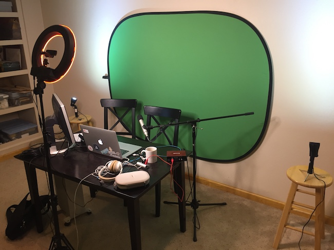
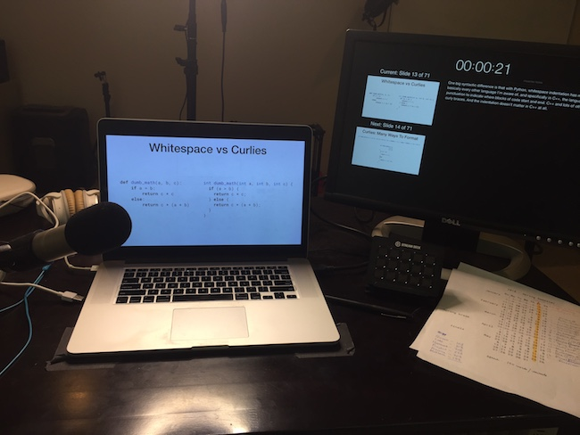
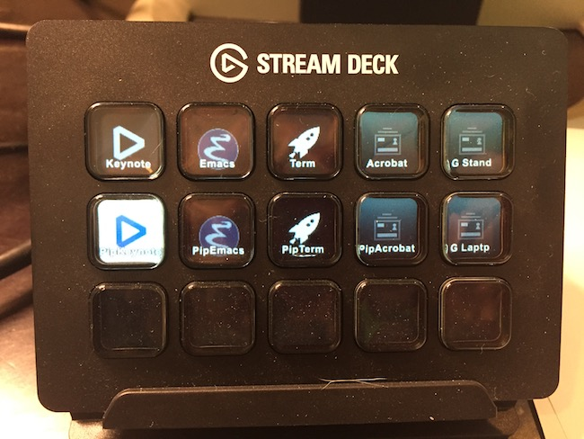
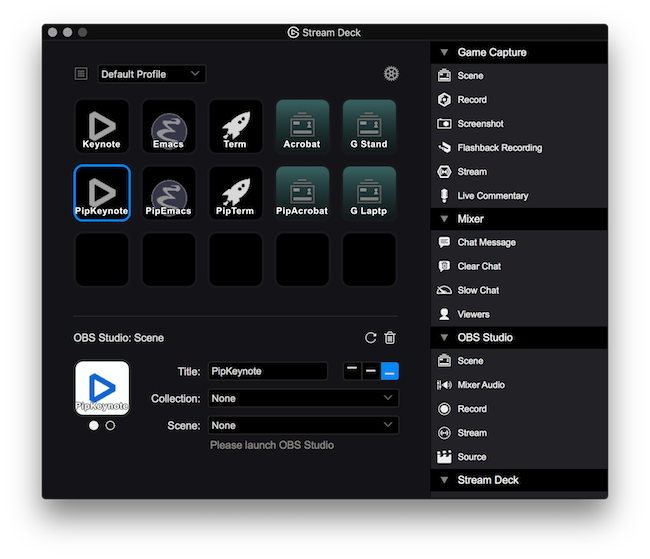

# Video Preparation
#### A CS Online Guide

A good lecture clip should be able to hold the viewer's attention for
the entire video. This is largely dependent
on [writing a proper script](scripts.md) and putting together good
graphics (slides, diagrams, and so forth). Making the video itself is
both a performance art and a technical production. This guide covers
just the technical aspects.

## TL;DR Checklist

**Do:**

- Set up lighting properly.
- Set up green screen properly.
- Set up camera to be in front of you about three feet away.
- Use two screens so you can read prompts from one of them and record
  the other.
- Set your microphone position and gain correctly to have good sound
  quality.
- Set up several OBS scenes for the various shots you want to record.
- Use StreamDeck to efficiently start and stop recordings and switch
  between scenes.
- Record in a widescreen format like 16:10 (1440 x 900 pixels).

**Don't:**

- Have weird shadows.
- Shoot the camera up your nose.
- Forget to level set your microphone.
- Shoot standard aspect ratio like 4:3 (1024 x 768 pixels).

## Technical Setup

This section outlines my video recording setup. It looks like this:

Points to note:

* There are no windows in this room. The lighting does not vary due to
  the time of day.
* There are two side lamps pointed at the ceiling.
* The main lamp is high enough that the displays will not cast much
  shadow on the green screen.
* The microphone is to my left because it is more convenient for me as
  a right-handed person. I bump it less often that way.
* Studio microphone is attached to an A-to-D interface (a Focusrite
  Scarlett Solo). Microphone is expensive (I happened to own one), and
  the Scarlett was $100.
* The laptop camera I use has a fairly wide field of view, so the desk
  is positioned close to the wall in order to avoid recording the
  black border around the green screen.

### Screens

Here is the view when recording:

My laptop has a good camera with an 16:10 aspect ratio display. I use
it as the primary display for presentations. I record in this aspect
ratio at 1440 x 900 pixels.

The secondary display to the right has the script and the presentation
runtime at the top. It shows the current slide and the upcoming
slide. The script is my primary focus while recording; the time and
next slide are useful information to have on my peripheral vision.

### Stream Deck

The Stream Deck is the black device between the laptop and secondary
display. It has a bunch of buttons that I can easily use with my
dominant hand without bumping anything.

The buttons map to different scenes: Keynote (top left) is the entire
laptop display; PipKeynote (middle left) is the laptop display with a
small picture-in-picture with video of me in the bottom right
corner. There are others for my editor, terminal, Adobe Acrobat, and a
couple of video-only scenes that I haven't really used.

Notice that the PipKeynote is visually distinct. I created a set of
high constrast icons for the StreamDeck so it would be obvious which
scene is currently in use without having to strain my eyes. Bright
icons are for the current scene; dark for scenes that are available
but not in use. Before I made these I ended up having to do more takes
because I didn't know that I was in the wrong scene.

### Camera Position

The closer to the camera, the more distorted your face will be. I keep
my chair positioned so that I am a good arm-and-a-half away from the
camera.

Also be aware of the camera angle. If it is below you, viewers will
have a fantastic view of the inside of your nose. The camera should be
roughly parallel to your nose, if not above.

If you have a DSLR, consider putting the camera farther away and use a
narrow viewing frustum. You'll look much better this way.

### Microphone Position

If you have a lapel (lavalier) microphone, be careful to not wear
loose clothing, because anything that rubs it will add awful noise.

If you have a directional microphone, be careful to not move your head
too much. The sound level will appear to vary quite a bit as you move
left and right.

Lapel microphones should be clipped over your sternum. If it is
closer, you'll likely get 'pops'; farther away and the signal will be
weaker than it should be.

### Microphone Level

The microphone will have a 'gain' setting. If you use a physical AD
interface like me, there's a physical dial for this. The software will
likely also have a gain dial. Whatever you have, the gain should be
set so that you have maximal signal without causing distortion. The AD
interface or software will probably have an input readout that varies
between green (no distortion), yellow (no distortion but getting
close) and red (distortion). To test it out, speak in your natural
style like you would in a lecture clip, and set the gain so the input
readout is mostly green, occasionally yellow, and never red.

### OBS Settings

The _Open Broadcaster Software_ system is an open source system to
record or stream screens (whole or portion), windows, cameras,
microphones. It looks like this:

The UI has these areas on the bottom. From left to right, there are
scenes, sources, the audio mixer, a transition thing (that I ignore),
and control buttons. More detail for each follows:

**Scenes** combine various video and audio sources into a single
recordable shot. I have scenes for recording slides, an editor,
terminal, and a few other things.

**Sources** are individual video and audio sources that comprise
whichever scene is selected. In the OBS screenshot, the Emacs scene is
selected, which is built out of two sources: the editor window, and
the microphone. My scenes are all simple, with one or two video
elements, and a microphone.

**Mixer** gives feedback on the current audio input level. You can
control the input gain with the dial here.

**Control buttons** include Start/Stop Recording, Settings, and Exit.

### Green Screen

To add a green screen video element, create a scene to hold it. Then
add a camera source. This should show your camera input, but it is not
removing the green screen just yet. To do that you need to add a
chroma key filter. 

Right click on the camera source and chose 'filter'. Pick 'Chroma
key'. There will be many options and settings here. Unfortunately
getting the right settings requires experimentation. They will depend
on the lighting in your room, the camera, even what you're wearing. If
your lights move or are aimed differently, you might have to adjust
the settings again. When it works, the green pixels are removed.

The settings I use for the chroma key are here because it might be
useful to see:

* Key Color Type: Green
* Similarity: 501
* Smoothness: 24
* Key Color Spill Reduction: 1
* Opacity: 100
* Contrast: 0

### Complete the Green Screen Scene

Now you have a green screen scene, but it is missing audio, and has a
black background. First add an audio input source to your
scene. Adjust the input level using the slider until your natural
speaking is as high as it can be without ever going red.

Last, add a color source to your scene. My slides are mostly white, so
I use a white color source so it blends in. Be sure the Sources are
stacked in this order: camera on top, color source on bottom. It will
composite the overall image using the stack order. If the color source
is on top, you won't see the camera input. It doesn't matter where the
microphone is in the order.

### Scene for Presentations

To capture slide presentations in full-screen, you have to capture an
entire display. Make a scene (I call mine 'Keynote' because that is
what I use for presentations). Add a source for 'Display Capture', and
pick which display to capture, such as "Display 0".

### Helpful OBS Tricks and Settings

**Keyboard shortcuts:** Change `Settings / Hotkeys / Start & Stop
Recording` to `F6`. You are unlikely to use this key otherwise. This
lets you start and stop the recording without having to flip over to
OBS.

**Choose where clips go:** Go to `Settings / Output / Recording
Path`. Set this to a dedicated directory. When shooting, I keep this
dedicated directory open on my secondary display so when I hit `F6` to
record, I can confirm that it is actually recording because a new file
will appear.

**Recording format:** Go to the same spot as recording path. For
reference, my settings are:

* Recording Quality: High Quality, Medium File Size
* Recording Format: mp4
* Encoder: Software (x264)

**Clip geometry:** Go to `Settings / Video`. I set this based on my
screen geometry. My screen is 16:10, so I use 1440x900 so the input
and output geometry is the same. If your screen is different you could
use a different resolution if you don't want black bars in the
output. Your output geometry won't be 16:10, though.

**StreamDeck:** You can set up the StreamDeck to have a button for
each Scene. To do this, open the StreamDeck app, and use the "OBS
Studio" section. Your scenes should be available. Just add them to the
button area, and your StreamDeck hardware should update
immediately. Pressing these buttons will switch scenes as directed.

